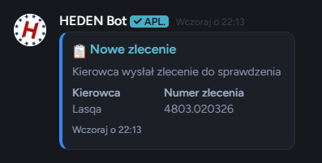
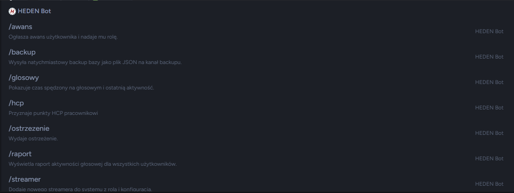
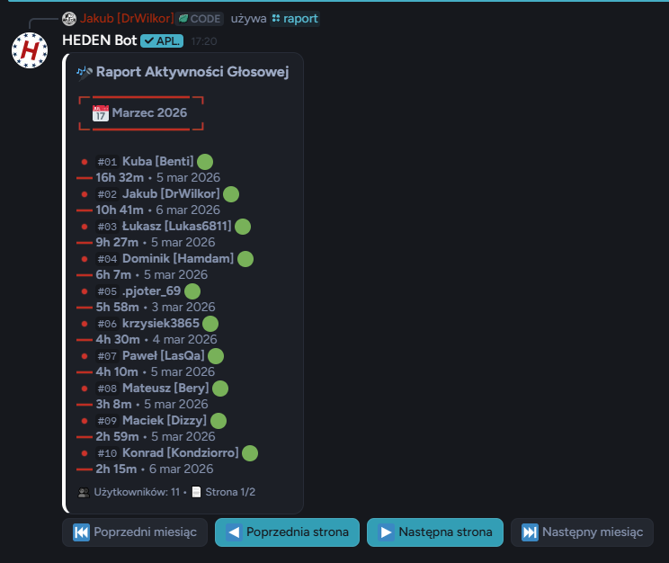

<div align="center">

# 🚚 HEDEN Cargo - Discord Bot

[](https://nodejs.org/)
[](https://discord.js.org/)
[](https://www.mongodb.com/)
[](https://expressjs.com/)
[](https://discord.com/users/446740090757316608)
[](#-licencja)

<br>

### 🚚 Zaawansowany bot Discord do zarządzania zleceniami spedycyjnymi i obsługi społeczności HEDEN Cargo

<br>

[✨ Funkcje](#-funkcje) •
[📸 Screenshots](#-screenshots) •
[🛠️ Technologie](#️-technologie) •
[📞 Kontakt](#-kontakt)

<br>

---

</div>

<br>

## ✨ Funkcje

<table>
<tr>
<td>

### 🎯 Zarządzanie Zleceniami
- ✅ System zlecen spedycyjnych
- ✅ Akceptacja/odrzucanie zleceń
- ✅ Tracking statusu zleceń
- ✅ Komentarze do zleceń

</td>
<td>

### 👥 Zarządzanie Pracownikami
- ✅ Panel zarządzania pracownikami
- ✅ System awansów i zwolnień
- ✅ System ostrzeżeń pracowników
- ✅ Raporty miesięczne z paginacją

</td>
</tr>
<tr>
<td>

### 🎤 Voice Tracking & Analityka
- ✅ Śledzenie czasu na kanałach voice
- ✅ Statystyki aktywności głosowej
- ✅ Heatmapy aktywności
- ✅ Analiza trendu użytkowania

</td>
<td>

### 🎬 Streamy & Multimedia
- ✅ Panel streamów (Twitch/YouTube/TikTok)
- ✅ System ogłoszeń społeczności
- ✅ Integracja streamerów
- ✅ Galeria zdjęć i fotoreportaż

</td>
</tr>
<tr>
<td>

### 🆘 Wsparcie & Komunikacja
- ✅ System ticketów pomocy
- ✅ Propozycje społeczności
- ✅ Wezwania pracowników
- ✅ Transkrypty rozmów

</td>
<td>

### 🛠️ Narzędzia & System
- ✅ Backup automtyczny MongoDB
- ✅ Auto-recovery system
- ✅ Szczegółowe logi działalności
- ✅ Web Dashboard (Express.js)

</td>
</tr>
</table>

<br>

## 📸 Screenshots

<div align="center">

### 📊 Panel Zarządzania Zleceniami



<br><br>

### 👥 Bot Discord w akcji



<br><br>

### 📈 Raporty i Statystyki



</div>

<br>

## 🎨 Przykładowe Logi

```
━━━━━━━━━━━━━━━━━━━━━━━━━━━━━━━━━━━━━━━━━━━━━━━━━
⚙️  HEDEN Cargo Bot - Uruchamianie...
━━━━━━━━━━━━━━━━━━━━━━━━━━━━━━━━━━━━━━━━━━━━━━━━━
[OK] ✓ Zalogowano jako HEDEN Cargo#1234
[INFO] Discord.js v14.8.0
[INFO] Serwer: HEDEN Cargo Sp. z o.o.
[INFO] MongoDB: Połączone
[TICKET] 🎫 System ticketów załadowany
[VOICE] 🎤 Voice tracking aktywny
[COMMAND] 🎯 Zarejestrowano 42 komendy slash
[OK] ✓ Bot gotowy do pracy!

[TICKET] 🎫 Nowy ticket #001 - Rekrutacja
[VOICE] 🔊 Użytkownik 𝓓𝓻𝓦𝓲𝓵𝓴𝓸𝓻 dołączył (1h 23m)
[SPEDYCJA] 🚚 Nowe zlecenie #045 - Dostawa Kraków
[REPORT] 📊 Raport wygenerowany dla marca 2026
```

<br>

## 🛠️ Technologie

<div align="center">

[](https://nodejs.org/)
[](https://discord.js.org/)
[](https://www.mongodb.com/)
[](https://expressjs.com/)
[](https://www.docker.com/)

</div>

### Stack Techniczny:

- **Backend:** Node.js 18+ z Discord.js 14
- **API:** Express.js z CORS i middleware
- **Baza Danych:** MongoDB 4.4+ (Atlas lub self-hosted)
- **Voice Tracking:** Integracja audio Discord
- **HTTP Requests:** Axios (async requests)
- **Containerization:** Docker & Docker Compose

<br>

## 🚀 Szybki Start

### Wymagania
- Node.js 18+
- npm lub yarn
- MongoDB (Atlas lub lokalnie)
- Token bota Discord
- Discord.js 14+

### Instalacja

```bash
# Instalacja zależności
npm install

# Konfiguracja
cp .env.example .env
# Edytuj .env i dodaj swoje tokeny

# Uruchamianie
npm start
```

<br>

## 📁 Struktura Projektu

```
HedenCargoWeb/
├── 📄 index.js                 # Główny plik bota
├── 📄 server.js                # Serwer Express
├── 📄 config.js                # Centralna konfiguracja
├── 📄 package.json             # Zależności
├── 📄 .env.example             # Wzorzec zmiennych
├── 📄 README.md                # Ta dokumentacja
├── 📄 BOT_COMMANDS.md          # Dokumentacja komend
├── 📄 Dockerfile               # Docker config
├── 📁 express_files/
│   ├── controller.js           # Kontrolery
│   ├── router.js               # Routery
│   └── mongo_schemas.js        # Schematy
├── 📁 src/
│   ├── commands/               # Komendy bota
│   ├── events/                 # Event handlery
│   ├── models/                 # Modele danych
│   ├── services/               # Usługi
│   └── utils/                  # Funkcje pomocnicze
└── 📁 scripts/
    └── clear_db.js             # Skrypty utility
```

<br>

## 💼 Dostępne na zamówienie

<div align="center">

### 🎯 Chcesz takiego bota dla swojej firmy?

<br>

| Pakiet | Opis |
|--------|------|
| 🎫 **Basic** | Bot do ticketów + voice tracking |
| 🚗 **Professional** | Pełny system zarządzania + reporting |
| 🏢 **Enterprise** | Wsparcie + hosting + utrzymanie |

<br>

### 📞 Skontaktuj się po wycenę!

</div>

<br>

## 📞 Kontakt

<div align="center">

### Zainteresowany? Napisz do nas!

<br>

| Developer | Discord | GitHub |
|-----------|---------|--------|
| **𝓓𝓻𝓦𝓲𝓵𝓴𝓸𝓻** | [Wilkor#446740090757316608](https://discord.com/users/446740090757316608) | [@WilkorPLYT](https://github.com/WilkorPLYT) |
| **daniek.** | [daniek.#640502766959329282](https://discord.com/users/640502766959329282) | [@daniekdan](https://github.com/daniekdan) |

</div>

<br>

## 📄 Licencja

<div align="center">

🔒 **Closed Source - Wszelkie prawa zastrzeżone**

Ten projekt jest własnością autora. Kod źródłowy nie jest publicznie dostępny.

Nieautoryzowane kopiowanie, modyfikowanie lub dystrybucja jest zabroniona.

Autor: WilkorPLYT & Daniel [Daniek.]
Copyright © 2024-2026 HEDEN Cargo Sp. z o.o.

</div>

<br>

---

<br>

## 👨‍💻 Autorzy

<div align="center">

[](https://github.com/WilkorPLYT)

<br>

Stworzony z ❤️ przez **𝓓𝓻𝓦𝓲𝓵𝓪𝓭𝓸𝓻** & **daniek.** dla **HEDEN Cargo Sp. z o.o.**

<br>

| Developer | Discord | GitHub |
|-----------|---------|--------|
| 𝓓𝓻𝓦𝓲𝓵𝓴𝓸𝓻 | [](https://discord.com/users/446740090757316608) | [](https://github.com/WilkorPLYT) |
| daniek. | [](https://discord.com/users/640502766959329282) | [](https://github.com/daniekdan) |

<br>

---

<br>

**⭐ Jeśli podoba Ci się ten projekt, zostaw gwiazdkę! ⭐**

</div>

<br>

---

<div align="center">

Made with ❤️ | HEDEN Cargo © 2024-2026

</div>
